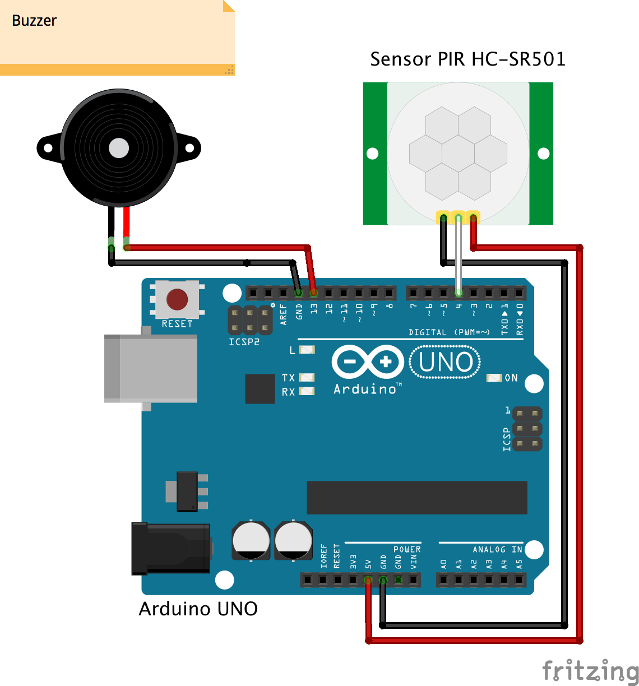

# Arduino motion_sensor_demo
this will show how to work with pir /motion sensor with arduino
# Required Components
> PIR Motion Sensor 

> Buzzer

> Arduino Uno R3 with cable

> Jumper Wire Male to Female x 5 

# Approx Project Cost : 625/-(iotwebplanet.com)

# All components availble at iotwebplanet.com

 # Connection Details
  
 > PIR Sensor pin     :        Arduino Uno pin
 
 > GND                 :       GND
 
 > VCC                  :      5v
 
 > OUTPUT                 :    3
 
 
 > Buzzer pin
 
 > VCC(+)                  :   13
 
 > GND                      :  GND
  
 

